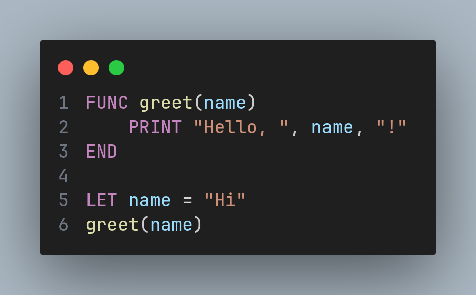

# Hi Language Support for VS Code

This extension provides **syntax highlighting**, **IntelliSense**, **code navigation**, and **script execution** for the [Hi programming language](https://github.com/hiveMC3310/hi-lang) directly in Visual Studio Code.



---

## Features

- **Syntax Highlighting** – Colorizes keywords, operators, strings, numbers, comments, and user-defined functions.
- **LSP Integration** – Powered by the `hi-lsp` language server, offering:
  - Hover information for functions, variables, and modules.
  - Auto‑completion for keywords, built‑in functions, module members, and user symbols.
  - Go to Definition and Find References.
  - Rename symbols across the project.
  - Diagnostics (errors and warnings) as you type.
- **Run Script** – Execute the current `.hi` file with a single click or keyboard shortcut.
- **Restart LSP Server** – Quickly restart the language server if needed.

---

## Installation

### Manual Installation (via VSIX)

1. Download the latest `.vsix` file from the [Releases](https://github.com/hi-lang-support/releases) page.
2. In VS Code, open the Extensions view (`Ctrl+Shift+X`), click the `...` menu, and select **Install from VSIX…**.
3. Choose the downloaded file.

---

## Configuration

The extension respects the following VS Code settings:

| Setting | Description | Default |
|---------|-------------|---------|
| `hi.serverPath` | Path to the `hi-lsp` executable. If empty, the extension looks for `hi-lsp` in `PATH`, then in the extension folder, then in `target/release`/`target/debug`. | `""` |
| `hi.interpreterPath` | Path to the `hi` interpreter used for running scripts. If empty, `hi` is used from `PATH`. | `""` |

To change these, open your user or workspace settings (`.vscode/settings.json`):

```json
{
  "hi.serverPath": "/absolute/path/to/hi-lsp",
  "hi.interpreterPath": "/absolute/path/to/hi"
}
```

If you place `hi-lsp` and `hi` in your project folder, you can use relative paths (e.g. `"./hi-lsp"`, `"./hi"`).

---

## Usage

### Running a Script

- **Keyboard shortcut:** `Ctrl+Shift+R` (when editing a `.hi` file).
- **Button:** Click the **Run** ▶️ icon in the editor toolbar (top‑right corner).

This opens a terminal named **Hi Run** and executes the current file with the configured interpreter.

### Restarting the Language Server

If you experience issues with code intelligence, restart the server:

- Open the Command Palette (`Ctrl+Shift+P`) and run **Restart Hi Language Server**.
- Or click the **Restart** button from the status bar (if available).

---

## Prerequisites

- The **Hi interpreter** (`hi`) – download from [Releases](https://github.com/hiveMC3310/hi-lang/releases) or build from source.
- The **Hi LSP server** (`hi-lsp`) – included in the same release package or built from the repository.

Make sure both executables are in your `PATH` or configured via the settings above.

---

## Troubleshooting

- **"Client is not running"** – Ensure `hi-lsp` exists and is executable. Check the **Output** panel (View → Output → select **Hi LSP**) for detailed logs.
- **Relative paths not working** – The extension resolves relative paths against the workspace root. If your workspace is not the project root, adjust the path accordingly.
- **Run command fails** – Verify that the interpreter is accessible. You can test by running `hi --version` in a terminal.

---

## License

[MIT](LICENSE) © 2026 Hi Language Contributors

---

**Happy coding in Hi! 🚀**
